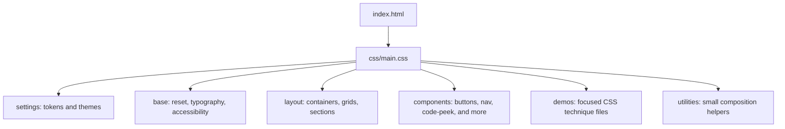

# Architecture

## Style flow



`main.css` imports every stylesheet and declares the layer order `settings, base, layout, components, demos, utilities`. All imported files wrap their rules in the corresponding named layer. Later layers have priority over earlier layers regardless of selector specificity, so overrides do not need increasingly complex selectors.

## File map

```text
.
├── .editorconfig
├── .gitignore
├── index.html
├── README.md
├── LICENSE
├── assets/icons/spark.svg
├── css/
│   ├── main.css
│   ├── 00-settings/{tokens,themes}.css
│   ├── 01-base/{reset,typography,accessibility}.css
│   ├── 02-layout/{container,grid,sections}.css
│   ├── 03-components/{button,card,navbar,accordion,tabs,modal,badge,code-peek,footer}.css
│   ├── 04-utilities/utilities.css
│   └── 05-demos/{demo-grid,demo-flexbox,demo-animations,demo-scroll-driven,demo-container-queries,demo-modern-selectors,demo-color-functions,demo-clip-mask,demo-theming}.css
└── docs/{ARCHITECTURE,CSS-TECHNIQUES}.md
```

## Naming and specificity

- Use BEM for components: `.block`, `.block__element`, `.block--modifier`.
- Use English names for classes, custom properties, files, and IDs.
- IDs may identify anchors or associate labels; never use IDs in CSS selectors.
- Prefer class selectors and `:where()` for rules that should remain easy to override.
- Do not use `!important`, except in the screen-reader-only utility and reduced-motion override. Those exceptions preserve hidden helper text and honor an explicit user accessibility preference.
- Prefer logical properties (`padding-inline`, `inset-block-start`) so writing direction and layout changes need fewer special cases.
- Keep each demonstration's behavior in its corresponding `05-demos` stylesheet; shared primitives belong in components or layout.

## Contribution rules

1. Keep visible copy in US English and provide a paired Brazilian Portuguese version for page content.
2. Write every source-code comment in both English and Portuguese.
3. Keep the page free of JavaScript, inline styles, external font requirements, and runtime dependencies.
4. Add a bilingual file header to each CSS file and wrap rules in the appropriate layer.
5. Add a focused code-peek to every page section and keep its excerpt synchronized with the referenced stylesheet.
6. Add a fallback or `@supports` guard when a newer feature is not needed for the base content.
7. Check keyboard use, reduced-motion behavior, and narrow viewports before publishing.
